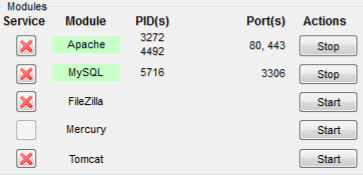

# Tutorial Membuat Aplikasi Sekolah Sederhana

Tutorial ini merupakan langkah-langkah yang digunakan untuk membuat aplikasi sekolah sederhana berbasis website

# Yang dibutuhkan
* Aplikasi Web Server
    - jika menggunakan windows, silahkan install ``XAMPP`` versi 7 ke atas, bisa di download di [apachefriends.com/downloads.html](https://www.apachefriends.org/download.html)
    - jika menggunakan linux, silahkan install package ``apache2`` melalui terminal
* Aplikasi web browser, seperti [Google Chrome](https://www.google.com/chrome/), [Mozilla Firefox](https://www.mozilla.org/en-US/firefox/new/), dan sebagainya.
* Aplikasi text editor, seperti [Sublime Text](https://www.sublimetext.com/download), [Visual Code Studio](https://code.visualstudio.com/download), dan sebagainya.


> Note: Pastikan setiap kebutuhan aplikasi tersebut sudah **tersedia dan berjalan dengan normal** di komputer / laptop yang kita akan gunakan untuk mengejakan project ini
___

# Langkah ke pertama
1. Nyalakan module / service apache pada komputer anda
    * jika mengunnakan ``XAMPP`` windows, silahkan nyalakan module ``apache`` dan ``mysql`` pada ``XAMPP Control Panel``, seperti pada gambar:
        
    


    * jika menggunakan ``apache2`` pada OS Linux, silahkan nyalakan service ``apache2`` dan ``mysqld``, contoh jika menggunakan OS linus turunan debian:

    ```console
    $ sudo service apache2 start && sudo service mysqld start
    ```


